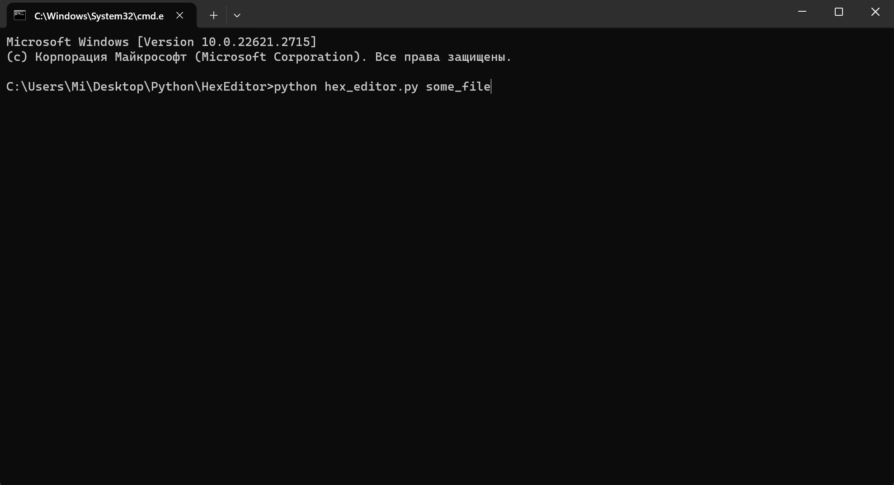
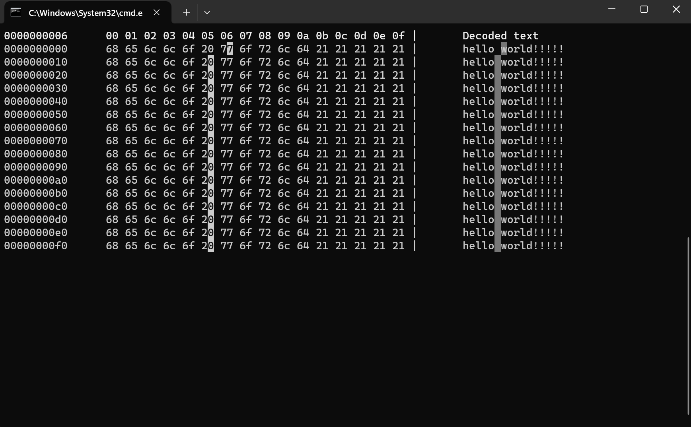

# Hex Editor

This is a simple hex editor with a console interface. It allows you to view and edit the hexadecimal representation of a file.

## Usage

To run the program, enter the following command:

```
python hex_editor.py [filename]
```

Please replace `[filename]` with the absolute or relative path to the file you want to edit.

## Features

- Multiple Cursors: The Hex Editor supports multiple cursors for editing convenience. You can add upper and lower cursors using the `Ctrl + Up` or `Ctrl + Down` combination. These cursors can be moved independently to edit different parts of the file simultaneously.

- Edit Restrictions: The use of the `delete` key and the `paste` functionality is limited in the Hex Editor using **multiple cursors**. This is done to prevent accidental deletion or modification of data. In the case of attempting to delete a character from the beginning of a large file, a dialog message is displayed, requiring user confirmation.

## Combinations

The following key combinations can be used while running the Hex Editor:

- `Ctrl + Z`: Undo the last action.
- `Ctrl + Y`: Redo the last undone action.
- `Ctrl + P`: Paste a string from the clipboard.
- `Ctrl + Up`: Add an upper cursor.
- `Ctrl + Down`: Add a lower cursor.

## Testing
To run tests, enter the following command

**WARNING**. The test will generate a large file size to test throwing a dialog message to the user when attempting to delete a character. Sized ~1.5 GB.

```
python -m pytest
```

## Screenshots


